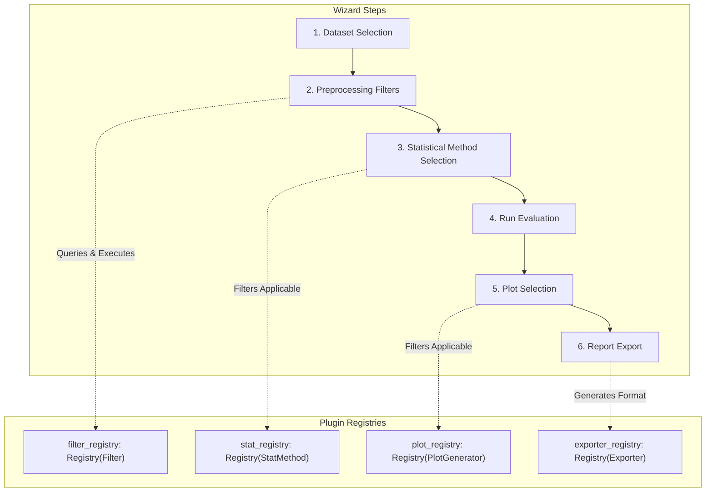

# ExpYT — Experiment Evaluation Wizard

[](https://github.com/Kugeleis/expyt/actions/workflows/ci.yml)
[](https://kugeleis.github.io/expyt/)
[](https://github.com/Kugeleis/expyt/actions/workflows/github-code-scanning/codeql)
[](https://www.python.org/downloads/)

ExpYT is a modular, extensible FastAPI backend that guides users through a multi-step statistical evaluation wizard: **Dataset Selection → Preprocessing Filters → Statistical Method → Run Evaluation → Plot Selection → Report Export**.

The project is built on SOLID open/closed principles, allowing developers to add new filters, statistical methods, plots, and exporters as plugins without modifying the core API router or orchestration logic.

---

## Architecture Diagram

The wizard maintains state using an in-memory session store (interfaced via a protocol dependency, allowing easy swap to Redis/DB). Each stage is guarded by step prerequisites. Applicability guards query registries to list options suited to the dataset's current characteristics (e.g., number of groups, normality, homogeneity of variance).



---

## App Structure

Here is an overview of the directory structure of the application:

```text
├── app/                      # Core FastAPI web application
│   ├── core/                 # Session models, step definitions, and storage interfaces
│   ├── datasets/             # Dataset loading and data property computation
│   ├── exporters/            # Extensible export plugins (built-in: JSON, PDF, HTML, etc.)
│   ├── filters/              # Extensible preprocessing filters (numeric ranges, category filters)
│   ├── main.py               # Application factory and startup orchestrator
│   ├── plots/                # Extensible plot generators (built-in: boxplot, scatter, etc.)
│   ├── static/               # Client-side single-page application
│   │   ├── modules/          # Modular ES6 frontend submodules
│   │   │   ├── api.js        # Backend fetch request wrappers
│   │   │   ├── elements.js   # Cached DOM element references
│   │   │   ├── events.js     # Event listeners registration
│   │   │   ├── helpers.js    # Shared helper utilities and error handlers
│   │   │   ├── navigation.js # Step-by-step panel navigation handlers
│   │   │   ├── state.js      # Global reactive state
│   │   │   └── ui.js         # DOM updates and visual rendering
│   │   ├── app.js            # Main bootstrap entry point
│   │   ├── index.html        # Wizard layout interface
│   │   └── style.css         # Single-green custom-themed Pico CSS overrides
│   ├── stats/                # Extensible statistical plugins (ANOVA, T-Test, etc.)
│   └── wizard/               # Router endpoints, request schemas, and transition controls
├── test_data/                # CSV datasets used for verification (e.g., nycflights.csv)
└── tests/                    # QA verification suite (unit, integration, and end-to-end)
```

---

## Getting Started

### Prerequisites
- Python >= 3.12
- [uv](https://github.com/astral-sh/uv) (Python package manager)

### Installation
Clone the repository and synchronize the environment:
```bash
uv sync
```

### Running the App Locally (Development)
Start the FastAPI server with auto-reload:
```bash
task dev
```
The documentation will be available at `http://127.0.0.1:8000/docs`.

---

## Development Workflow & QA

Quality gates are strictly enforced. All tasks can be run via the task runner:

| Command | Description |
|---|---|
| `task install` | Installs dependencies |
| `task lint` | Runs `ruff check` and `ruff format --check` |
| `task format` | Auto-formats code with `ruff` |
| `task typecheck` | Runs `mypy --strict` on code |
| `task test` | Runs the test suite with coverage check (>90% required) |
| `task check` | Runs all quality gates (lint -> typecheck -> test) |
| `task bump -- <patch/minor/major>` | Bumps the application version using `bump-my-version` |

---

## Extensibility: Adding Custom Plugins

Adding a new plugin requires **zero changes** to core routing or session orchestration. Simply define a subclass and register it with the appropriate decorator.

### 5-Line Recipe Example

Here is how you can add a custom statistical method in under 10 lines:

```python
from app.stats.base import StatMethod, StatResult, stat_registry

@stat_registry.register("zscore_outliers")
class ZScoreOutliersMethod(StatMethod):
    name = "zscore_outliers"
    description = "Checks for outlier points using Z-score."

    def is_applicable(self, **properties) -> bool:
        return properties.get("n_groups", 0) >= 1

    def run(self, groups) -> StatResult:
        # custom calculations...
        return StatResult(
            method_name=self.name,
            test_statistic=1.96,
            p_value=0.05,
            effect_size=None,
            summary="Completed outlier check."
        )
```

The system will automatically:
1. Discover the plugin at startup (under `app/stats/builtin` or when imported).
2. Include it in the `GET /wizard/sessions/{id}/methods` response if `is_applicable` returns `True`.
3. Accept it in `POST /wizard/sessions/{id}/method` and run it during `GET /wizard/sessions/{id}/results`.

The same recipe applies to:
- **Filters**: Inherit `Filter`, register to `filter_registry`.
- **Plots**: Inherit `PlotGenerator`, register to `plot_registry`.
- **Exporters**: Inherit `Exporter`, register to `exporter_registry`.

---

## Statistical Method Selection

In Step 3, the wizard dynamically queries the backend to determine which statistical methods are applicable to your filtered dataset. This process relies on automated data property computation and applicability rules:

1. **Auto-Computation (`compute_data_properties`)**:
   When moving to Step 3, the backend evaluates the dataset properties including:
   - **Normality**: Shapiro-Wilk or D'Agostino-Pearson tests per group.
   - **Variance Homogeneity**: Levene's test to ensure groups have equal variances.
   - **Sphericity**: Mauchly's test for repeated measures (with 3+ conditions).
   - **Expected Cell Counts**: Contingency table evaluation for categorical outcomes.
   - **Missing Data & Outliers**: Automated checks to summarize dataset health.

2. **Applicability Checking (`is_applicable`)**:
   Each registered statistical method implements `is_applicable(**properties)` to declare its preconditions:
   - **Independent Two-Sample t-test**: Requires exactly 2 groups of numeric data, with $n \ge 2$ per group, and normality satisfied for all groups.
   - **One-way ANOVA**: Requires $\ge 2$ groups of numeric data, with $n \ge 2$ per group, normality satisfied, and homogeneous variance.
   - **Mann-Whitney U**: Non-parametric; requires exactly 2 groups of numeric data with $n \ge 2$ per group.
   - **Kruskal-Wallis H**: Non-parametric; requires $\ge 2$ groups of numeric data with $n \ge 2$ per group.

If any preconditions are not met, the method is filtered out from the list of selectable options in the GUI.
